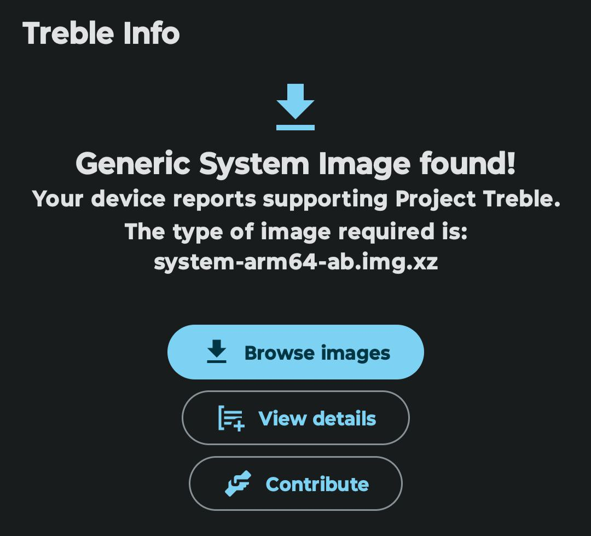

# 🔧 Creating Your First Build!


**Dev Tip : The More Core Your Machine has the faster you could complete this process... Also a higher RAM amount would also help!**


## Setting Up for Build

Only Once You Have Fully Completed the repo sync you might continue this step if you are not sure that the repo was fully synced run this command in your directory which has .repo folder :

```
repo status
```

if you see :

```
Up To Date (or something simillar)
```

you are good to go with the steps, if you see :

```
error not synced : xyz................
```

run the \`repo sync \[and all other stuff]\` command again; for other error check out online!

### Builds

So, you've come really close to your build for starters, I'll recommend you to build a GSI (Generic System Image) but, before that **make sure your device supports Project Treble** it's quite simple if your deive was shipped with Android 9 (Pie) or higher it's very likely that your device supports it or else, if your device was shipped with a lower android version 8.0 (Oreo) or lower you can check it by searching :

```
Does [device name] support project treble?
```

Now that you're setup install Treble Info app on your device go ahead on playstore and search for it!

Next check the first page of the app, for reference I see something like this:

<figure><figcaption><p>The Treble Info App's Homepage</p></figcaption></figure>

Now, when we look at the type of image required we see :

<mark style="color:yellow;">**system-arm64-ab.img.xz**</mark>

Note that down we'll need it later...

## The Final Build Process:

Now open the `eternal` directory and right click and select the `Open In Terminal` option now paste this code:

```
# Set up environment
. build/envsetup.sh
```

then,

```
# Choose a target
$ lunch gsi_$arch-user
```

lastly,

```
# m -j$(nproc --all)
```

## Voila! That was your first build to continue check the button below ⬇️
